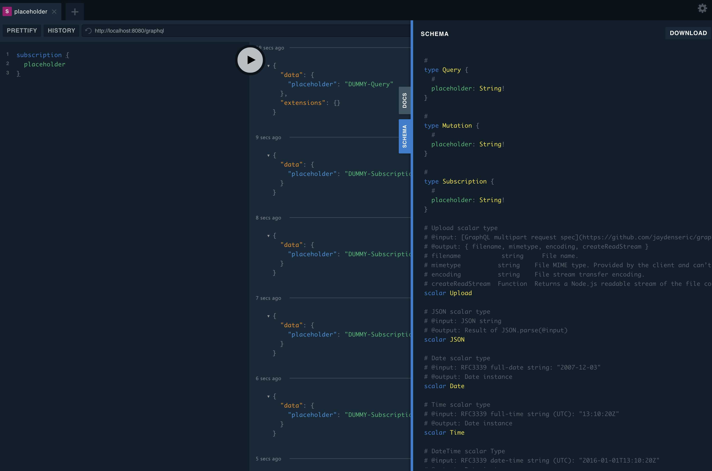

# Get Started

## 1. Install the package



```text
yarn add moleculer-api
```



```
npm i --save moleculer-api
```



Add `moleculer-api` package from npm.

## 2. Run the gateway



```typescript
import { APIGateway, APIGatewayOptions } from "moleculer-api";

const options: APIGatewayOptions = {
    // ...
};
const gateway = new APIGateway(options);
gateway.start()
    .then(() => {
        // ...
    });

```



```javascript
const { APIGateway } = require("moleculer-api");

const options = {
    // ...
};
const gateway = new APIGateway(options);
gateway.start()
    .then(() => {
        // ...
    });

```



And write entry script like above. For now, let's skip setting detailed options.

## 3. Check the log and few endpoints

```text
2020-11-17T07:25:17.944Z info dwkimqmit.local/broker[0]/moleculer: Moleculer v0.14.11 is starting...
2020-11-17T07:25:17.946Z info dwkimqmit.local/broker[0]/moleculer: Namespace: <not defined>
2020-11-17T07:25:17.947Z info dwkimqmit.local/broker[0]/moleculer: Node ID: dwkimqmit.local-58669
2020-11-17T07:25:17.947Z info dwkimqmit.local/broker[0]/moleculer: Strategy: RoundRobinStrategy
2020-11-17T07:25:17.947Z info dwkimqmit.local/broker[0]/moleculer: Discoverer: LocalDiscoverer
2020-11-17T07:25:17.948Z info dwkimqmit.local/broker[0]/moleculer: Serializer: JSONSerializer
2020-11-17T07:25:17.953Z info dwkimqmit.local/broker[0]/moleculer: Validator: FastestValidator
2020-11-17T07:25:17.954Z info dwkimqmit.local/broker[0]/moleculer: Registered 13 internal middleware(s).
2020-11-17T07:25:17.964Z info dwkimqmit.local/server: gateway context factories have been applied id, ip, locale, cookie, userAgent, request, auth
2020-11-17T07:25:17.968Z info dwkimqmit.local/server: gateway server middleware have been applied: cors, bodyParser, logging, error
2020-11-17T07:25:17.969Z info dwkimqmit.local/server/application: gateway server application has been started: http<HTTPRoute>, ws<WebSocketRoute>
2020-11-17T07:25:17.971Z info dwkimqmit.local/server: gateway server protocol has been started: http
2020-11-17T07:25:17.971Z info dwkimqmit.local/server: gateway server has been started and listening on: http://localhost:8080, ws://localhost:8080
2020-11-17T07:25:17.972Z info dwkimqmit.local/schema: schema policy plugin has been started: filter, scope
2020-11-17T07:25:17.972Z info dwkimqmit.local/schema: schema protocol plugin has been started: GraphQL, REST, WebSocket
2020-11-17T07:25:17.973Z info dwkimqmit.local/schema: master (0 services) branch has been created
2020-11-17T07:25:17.991Z info dwkimqmit.local/schema/master: master (0 services) branch succeeded 1239eb4a (0 schemata, 0 routes) -> 7a2db312 (0 schemata, 4 routes) version compile:
(+) /graphql (http:POST): GraphQL HTTP operation endpoint
(+) /graphql (ws): GraphQL WebSocket operation endpoint
(+) /graphql (http:GET): GraphQL Playground endpoint
(+) /~status (http:GET): master branch introspection endpoint
2020-11-17T07:25:17.991Z info dwkimqmit.local/schema: master (0 services) branch has been updated
2020-11-17T07:25:17.992Z info dwkimqmit.local/schema: schema registry has been started
2020-11-17T07:25:17.993Z info dwkimqmit.local/broker[0]/moleculer: '$api' service is registered.
2020-11-17T07:25:17.995Z info dwkimqmit.local/broker[0]/moleculer: Service '$api' started.
2020-11-17T07:25:17.997Z info dwkimqmit.local/broker[0]/moleculer: '$node' service is registered.
2020-11-17T07:25:17.997Z info dwkimqmit.local/broker[0]/moleculer: Service '$node' started.
2020-11-17T07:25:17.998Z info dwkimqmit.local/broker[0]/moleculer: Service '$api' started.
2020-11-17T07:25:17.998Z info dwkimqmit.local/broker[0]/moleculer: ✔ ServiceBroker with 2 service(s) is started successfully in 3ms.
2020-11-17T07:25:17.999Z info dwkimqmit.local/broker[0]: service broker has been started: moleculer
2020-11-17T07:25:19.997Z info dwkimqmit.local/server/application: master (0 services) handler mounted for http<HTTPRoute> component
2020-11-17T07:25:19.998Z info dwkimqmit.local/server/application: master (0 services) handler mounted for ws<WebSocketRoute> component
```

With default options configuration, A gateway will run on localhost 8080 port with HTTP protocol. And basic placeholder scheme for GraphQL plugin, playground for GraphQL and a default status check endpoint will be set.

* [http://localhost:8080/~status](http://localhost:8080/~status) An endpoint to show the status each API integrations. It will show the integration status from oldest version to latest version with detailed integrations belong to each versions by each branches \(only master branch initially\).

```javascript
{
  "branch": "master",
  "latestUsedAt": "2020-11-17T07:45:03.322Z",
  "parentVersion": null,
  "latestVersion": "7a2db312",
  "versions": [
    {
      "version": "7a2db312",
      "fullVersion": "7a2db312e34f6105efb5ec107137763b",
      "routes": [
        "/graphql (http:POST): GraphQL HTTP operation endpoint",
        "/graphql (ws): GraphQL WebSocket operation endpoint",
        "/graphql (http:GET): GraphQL Playground endpoint",
        "/~status (http:GET): master branch introspection endpoint"
      ],
      "integrations": []
    },
    {
      "version": "1239eb4a",
      "fullVersion": "1239eb4a8416af46c0448426b51771f5",
      "routes": [],
      "integrations": []
    }
  ],
  "services": []
}

```

* [http://localhost:8080/graphql](http://localhost:8080/graphql) A playground endpoint which is set from GraphQL Protocol Plugin.



